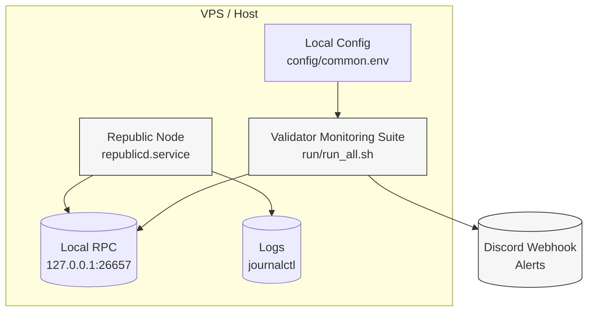
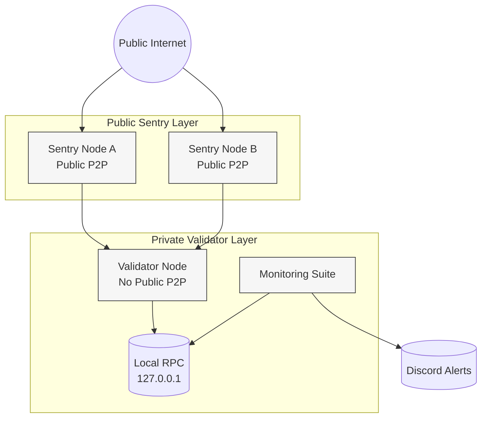

## Table of Contents

- [System Requirements](#system-requirements)
- [Variables](#0-variables)
- [Installation](#1-install-dependencies)
- [Initialize Node](#3-initialize-node)
- [State Sync](#6-optional-state-sync-fast-sync)
- [Firewall](#9-firewall-ufw-recommended)
- [Validator Operations](#validator-operations)
- [Advanced Validator Operations](#advanced-validator-operations)
- [Monitoring Integration](#monitoring-integration-validator-monitoring-suite)
- [Architecture](#architecture-monitoring--node)
- [Production Sentry Architecture](#production-sentry-architecture)

---

# Republic Node Setup (Testnet)


Production-ready Republic node setup with systemd, state sync, firewall configuration and operational checks.

Maintained by **Xibz** — infrastructure operator focused on monitoring, reliability and security-first deployments.

---

## System Requirements

| Component | Minimum | Recommended |
|-----------|----------|-------------|
| CPU | 2 cores | 4+ cores |
| RAM | 4 GB | 8–16 GB |
| Disk | 100 GB SSD | 200+ GB NVMe |
| OS | Ubuntu 22.04+ | Ubuntu 22.04 / 24.04 |

---

# 0) Variables

Update according to official Republic documentation.

```bash
export CHAIN_ID="raitestnet_77701-1"
export BINARY="republicd"
export HOME_DIR="$HOME/.republicd"

# Replace with official values
export GENESIS_URL=""
export SEEDS=""
export PEERS=""
```

---

# 1) Install Dependencies

```bash
sudo apt update -y
sudo apt install -y curl jq git build-essential ufw
```

---

# 2) Install Binary

Follow official Republic repository instructions.

Example:

```bash
# git clone <REPO>
# cd <REPO>
# make install
```

Verify:

```bash
which $BINARY
$BINARY version
```

---

# 3) Initialize Node

```bash
$BINARY init "Xibz" --chain-id $CHAIN_ID
```

---

# 4) Download Genesis

```bash
curl -L $GENESIS_URL -o $HOME_DIR/config/genesis.json
```

---

# 5) Configure Seeds / Peers

Edit:

```bash
nano $HOME_DIR/config/config.toml
```

Set:

```
seeds = "$SEEDS"
persistent_peers = "$PEERS"
```

---

# 6) Optional: State Sync (Fast Sync)

⚠ Always verify RPC servers are trustworthy.

Example template:

```bash
SNAP_RPC="https://rpc.example.com:443"

LATEST_HEIGHT=$(curl -s $SNAP_RPC/block | jq -r .result.block.header.height)
BLOCK_HEIGHT=$((LATEST_HEIGHT - 2000))
TRUST_HASH=$(curl -s "$SNAP_RPC/block?height=$BLOCK_HEIGHT" | jq -r .result.block_id.hash)

sed -i.bak -e "s|^enable *=.*|enable = true|" \
-e "s|^rpc_servers *=.*|rpc_servers = \"$SNAP_RPC,$SNAP_RPC\"|" \
-e "s|^trust_height *=.*|trust_height = $BLOCK_HEIGHT|" \
-e "s|^trust_hash *=.*|trust_hash = \"$TRUST_HASH\"|" \
$HOME_DIR/config/config.toml
```

Restart node after enabling state sync.

---

# 7) Create Dedicated User

```bash
sudo adduser --disabled-password --gecos "" validator
sudo usermod -aG sudo validator
```

---

# 8) systemd Service

```bash
sudo nano /etc/systemd/system/republicd.service
```

Paste:

```ini
[Unit]
Description=Republic Node
After=network-online.target
Wants=network-online.target

[Service]
User=validator
ExecStart=/usr/local/bin/republicd start --home /home/validator/.republicd
Restart=on-failure
RestartSec=5
LimitNOFILE=65535

NoNewPrivileges=true
PrivateTmp=true

[Install]
WantedBy=multi-user.target
```

Enable & start:

```bash
sudo systemctl daemon-reload
sudo systemctl enable republicd
sudo systemctl restart republicd
sudo journalctl -u republicd -f --no-hostname
```

---

# 9) Firewall (UFW Recommended)

Enable firewall:

```bash
sudo ufw allow ssh
sudo ufw allow 26656/tcp
sudo ufw enable
```

Optional (if RPC needed):

```bash
sudo ufw allow 26657/tcp
```

⚠ Do NOT expose RPC publicly unless required.

---

# 10) Sync Check

```bash
curl -s localhost:26657/status | jq -r '.result.sync_info'
```

Check catching up:

```bash
curl -s localhost:26657/status | jq -r '.result.sync_info.catching_up'
```

---

# 11) Operational Notes

- Keep RPC private
- Never store mnemonics on VPS
- Monitor disk growth
- Watch missed blocks
- Implement monitoring (recommended)

---

# Monitoring

For production monitoring:

- validator-monitoring-suite
- cosmos-validator-playbook

---

# Architecture (Monitoring + Node)



**Flow:**
- `republicd` runs as a `systemd` service and exposes a **local** RPC endpoint.
- Monitoring reads health via RPC + service status.
- On failure, a Discord alert is sent via webhook.

---

# Production Sentry Architecture



## Design Principles

- Validator node is **not publicly exposed**
- Only sentries accept public P2P traffic
- Validator peers only with sentries
- RPC remains local/private
- Monitoring reads local RPC
- Alerts are sent externally via webhook

## Security Benefits

- Reduced DDoS surface
- Isolation of signing key
- Controlled peer topology
- Cleaner incident boundaries

---

# Monitoring Integration (validator-monitoring-suite)

This setup is designed to plug into my monitoring framework:

- **validator-monitoring-suite** (multi-network checks + Discord alerts)

## 1) Install monitoring suite

```bash
cd $HOME
git clone https://github.com/Xibz34/validator-monitoring-suite.git
cd validator-monitoring-suite
```

## 2) Create local config (DO NOT COMMIT)

```bash
cp config/common.env.example config/common.env
nano config/common.env
```

Fill at minimum:

- `DISCORD_WEBHOOK_URL`
- `REPUBLIC_RPC` (example: `http://127.0.0.1:26657`)
- `REPUBLIC_SERVICE` (example: `republicd`)
- `REPUBLIC_CHAIN_BINARY` (example: `republicd`)
- `REPUBLIC_CHAIN_ID` (example: `raitestnet_77701-1`)
- `REPUBLIC_VALOPER` (your valoper address)

## 3) Make scripts executable

```bash
chmod +x lib/*.sh checks/*.sh run/*.sh
```

## 4) Run a manual check

```bash
CONFIG_FILE=./config/common.env ./run/run_all.sh
```

If a check fails, you will receive a Discord alert.

## 5) Cron (run every 5 minutes)

```bash
crontab -e
```

Add:

```cron
*/5 * * * * /bin/bash -lc 'cd $HOME/validator-monitoring-suite && CONFIG_FILE=./config/common.env ./run/run_all.sh >> $HOME/validator-monitoring.log 2>&1'
```

## Notes

- Keep `config/common.env` local (it should be ignored via `.gitignore`)
- Prefer using `http://127.0.0.1:26657` for local RPC checks
- Do not expose RPC publicly unless you must

---

## Quick Setup (Safe One-Block Installation)

The following block installs and prepares the monitoring suite without executing remote scripts.

```bash
# 1️⃣ Clone repository
cd $HOME
git clone https://github.com/Xibz34/validator-monitoring-suite.git

# 2️⃣ Enter directory
cd validator-monitoring-suite

# 3️⃣ Create local config
cp config/common.env.example config/common.env

# 4️⃣ Edit config manually (required)
nano config/common.env
```

Fill at minimum:

```
DISCORD_WEBHOOK_URL=
REPUBLIC_RPC=http://127.0.0.1:26657
REPUBLIC_SERVICE=republicd
REPUBLIC_CHAIN_BINARY=republicd
REPUBLIC_CHAIN_ID=raitestnet_77701-1
REPUBLIC_VALOPER=
```

Then:

```bash
# 5️⃣ Make scripts executable
chmod +x lib/*.sh checks/*.sh run/*.sh

# 6️⃣ Run manual test
CONFIG_FILE=./config/common.env ./run/run_all.sh
```

If everything is configured correctly:

- No output → All checks passed
- Discord alert → Something failed

---

## Optional: Cron (Every 5 Minutes)

```bash
crontab -e
```

Add:

```cron
*/5 * * * * /bin/bash -lc 'cd $HOME/validator-monitoring-suite && CONFIG_FILE=./config/common.env ./run/run_all.sh >> $HOME/validator-monitoring.log 2>&1'
```

---

### Why This Approach?

- No remote script execution
- No hidden commands
- Fully auditable installation
- Production-friendly setup

---

# Validator Operations

⚠ Never store mnemonics or private keys on a public VPS.

## Create Wallet

```bash
$BINARY keys add wallet
```

Recover existing wallet:

```bash
$BINARY keys add wallet --recover
```

Show address:

```bash
$BINARY keys show wallet -a
```

---

## Create Validator

After funding your wallet:

```bash
$BINARY tx staking create-validator \
  --amount 1000000utoken \
  --pubkey $($BINARY tendermint show-validator) \
  --moniker "Xibz" \
  --chain-id $CHAIN_ID \
  --commission-rate "0.05" \
  --commission-max-rate "0.20" \
  --commission-max-change-rate "0.01" \
  --min-self-delegation "1" \
  --gas auto \
  --gas-adjustment 1.3 \
  --gas-prices 0.025utoken \
  --from wallet \
  -y
```

> Replace `utoken` with the correct staking denom.

---

## Check Validator Status

```bash
$BINARY query staking validator $($BINARY keys show wallet --bech val -a)
```

Check jailed status:

```bash
$BINARY query staking validator <your_valoper_address> | jq '.jailed'
```

---

## Unjail Validator

If jailed due to missed blocks:

```bash
$BINARY tx slashing unjail \
  --from wallet \
  --chain-id $CHAIN_ID \
  --gas auto \
  --gas-adjustment 1.3 \
  --gas-prices 0.025utoken \
  -y
```

---

## Check Missed Blocks

```bash
$BINARY query slashing signing-info \
  $($BINARY tendermint show-validator) \
  --chain-id $CHAIN_ID
```

---
---

# Advanced Validator Operations

## 1) Auto-Unjail (Safe & Rate-Limited)

⚠ This script does NOT solve slashing risks.  
Always fix the root cause (peering, CPU, disk, network) before relying on automation.

### Script: `scripts/auto_unjail.sh`

```bash
#!/usr/bin/env bash
set -euo pipefail

# ===== Required environment variables =====
: "${BINARY:?missing BINARY}"
: "${CHAIN_ID:?missing CHAIN_ID}"
: "${WALLET:?missing WALLET}"
: "${GAS_PRICES:?missing GAS_PRICES}"

# Safety switch (must be explicitly enabled)
ENABLE_AUTO_UNJAIL="${ENABLE_AUTO_UNJAIL:-false}"
if [[ "$ENABLE_AUTO_UNJAIL" != "true" ]]; then
  echo "AUTO_UNJAIL disabled (set ENABLE_AUTO_UNJAIL=true)"
  exit 0
fi

NODE_ARG=()
if [[ -n "${NODE:-}" ]]; then
  NODE_ARG=(--node "$NODE")
fi

VALOPER="$($BINARY keys show "$WALLET" --bech val -a)"
if [[ -z "$VALOPER" ]]; then
  echo "Could not resolve valoper address for wallet=$WALLET"
  exit 1
fi

JAILED="$($BINARY query staking validator "$VALOPER" "${NODE_ARG[@]}" -o json 2>/dev/null | jq -r '.jailed // empty' || true)"
if [[ "$JAILED" != "true" ]]; then
  echo "Validator is not jailed (jailed=$JAILED)"
  exit 0
fi

echo "Validator is JAILED → attempting unjail..."

$BINARY tx slashing unjail \
  --from "$WALLET" \
  --chain-id "$CHAIN_ID" \
  --gas auto \
  --gas-adjustment 1.3 \
  --gas-prices "$GAS_PRICES" \
  "${NODE_ARG[@]}" \
  -y

echo "Unjail transaction broadcasted. Verify status shortly."
```

Make it executable:

```bash
chmod +x scripts/auto_unjail.sh
```

### Cron Example (Every 10 Minutes)

```bash
crontab -e
```

Add:

```cron
*/10 * * * * /bin/bash -lc 'cd $HOME/Republic-Node-Setup && BINARY=republicd CHAIN_ID=raitestnet_77701-1 WALLET=wallet GAS_PRICES=0.025utoken ENABLE_AUTO_UNJAIL=true ./scripts/auto_unjail.sh >> $HOME/auto_unjail.log 2>&1'
```

---

## 2) Update Commission

Check current commission:

```bash
$BINARY query staking validator $($BINARY keys show wallet --bech val -a) -o json | jq '.commission'
```

Update commission rate:

```bash
$BINARY tx staking edit-validator \
  --commission-rate "0.06" \
  --from wallet \
  --chain-id $CHAIN_ID \
  --gas auto \
  --gas-adjustment 1.3 \
  --gas-prices 0.025utoken \
  -y
```

> Commission change limits depend on chain parameters.

---

## 3) Increase Self-Delegation

Delegate additional tokens:

```bash
VALOPER="$($BINARY keys show wallet --bech val -a)"

$BINARY tx staking delegate \
  "$VALOPER" \
  1000000utoken \
  --from wallet \
  --chain-id $CHAIN_ID \
  --gas auto \
  --gas-adjustment 1.3 \
  --gas-prices 0.025utoken \
  -y
```

---

## 4) Sentry Architecture & Remote Signer (High-Level)

Recommended production architecture:

- Public **sentry nodes** handle external P2P traffic
- The **validator node remains private**
- Validator peers only with sentry nodes (private networking or IP allowlist)

Security recommendations:

- Never expose validator RPC publicly
- Consider remote signer setups (e.g., TMKMS / Horcrux)
- Keep validator keys offline when possible
- Restrict access to `priv_validator_key.json`
- Maintain secure offline backups

---

## 5) Useful Operational Commands

Show validator address:

```bash
$BINARY keys show wallet --bech val -a
```

Show consensus public key:

```bash
$BINARY tendermint show-validator
```

Check signing info (missed blocks):

```bash
$BINARY query slashing signing-info \
  $($BINARY tendermint show-validator) \
  --chain-id $CHAIN_ID \
  -o json | jq
```

---

## 6) Production Best Practices

- Monitor jailed status and missed blocks
- Set alerts for height lag
- Keep RPC private (allowlist if required)
- Separate sentry and validator nodes
- Document incidents and update runbooks

---

## Operational Best Practices

- Monitor missed blocks continuously
- Alert on jailed status
- Keep commission transparent
- Rotate keys securely if required
- Maintain proper backups (offline only)

---

# Operational Maturity

This setup follows production-grade principles:

- Infrastructure isolation (sentry model)
- Automated health monitoring
- Controlled validator lifecycle management
- Incident documentation discipline
- Security-first deployment model

This repository is part of a broader validator infrastructure stack.

---

# Disclaimer

Use at your own risk. Always verify chain parameters from official sources.